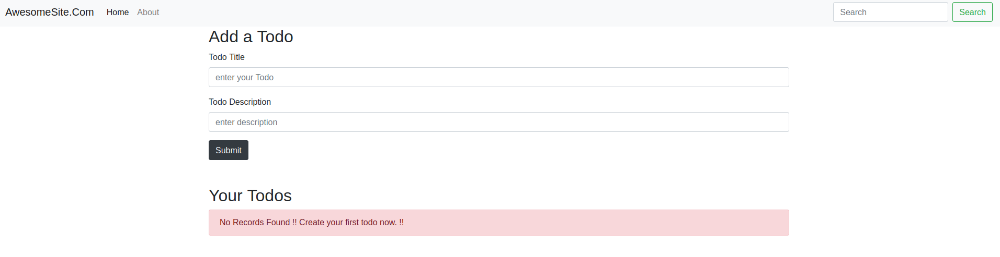
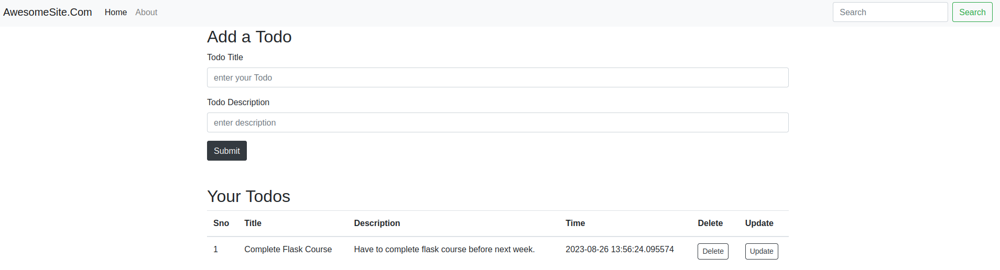
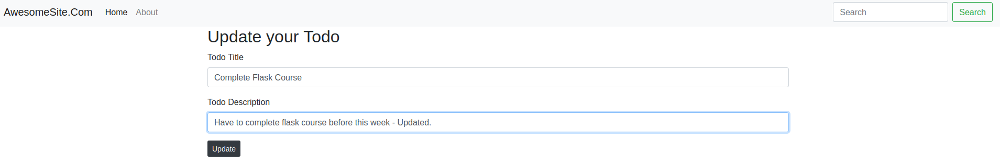

# Todo List Web App
This is a simple Todo list web app built using Python and Flask. It allows users to manage their tasks by adding, updating, and deleting todo items. The app uses SQLAlchemy to interact with a SQLite database for storing the todo items.

## Features
### - Add a new todo item with a title and description.
### - Update an existing todo item's title and description.
### - Delete a todo item from the list.
### - List all existing todo items.

## Installation
1. Clone this repository to your local machine using:
```
git clone https://github.com/abhishekgunkar1/ToDo-App-with-Flask.git
```

2. Navigate to the project directory:
```
cd ToDo-App-with-Flask
```

3. Install the required dependencies:
```
pip install -r requirements.txt
```

4. Run the Flask development server:
```
python3 app.py 
```

5. Open your web browser and go to `http://localhost:5000` to access the app.


## Usage

#### - To add a new todo item, click on the "Add Todo" button and fill in the title and description.
#### - To update an existing todo item, click on the todo you want to edit and click the "Edit" button.
#### - To delete a todo item, click on the todo you want to delete and click the "Delete" button.


## Technologies Used

#### - Python
#### - Flask
#### - SQLAlchemy
#### - SQLite

## Initial Screen


## Adding one todo Screen


## Updating one todo Screen


## Deleting one todo Screen

